# Router

[1. Introduction](#introduction)
[2. Official sysupgrade .bin](#official-sysupgrade-bin)
[3. Image Builder sysupgrade .bin w/o modifications](#image-builder-sysupgrade-bin-wo-modifications)
[4. Custom sysupgrade .bin](#custom-sysupgrade-bin)
[5. Basic Configuration](#basic-configuration)
[6. Advanced Configuration](#advanced-configuration)

## Introduction

Packages can be installed with `opkg` or over the web interface (aka `luci`) on devices with large storage capacity. In contrast to my modem setup, I don't have the requirement of keeping the image as small as possible. Nevertheless, I still prefer building my own image with OpenWrt's [Image Builder](https://openwrt.org/docs/guide-user/additional-software/imagebuilder), especially with the requirement of replacing DNSMasq with Unbound and enabling WPA3.

```bash
local $ ls -1
openwrt-19.07.7-ipq806x-generic-tplink_c2600-squashfs-sysupgrade.bin
openwrt-imagebuilder-19.07.7-ipq806x-generic.Linux-x86_64.tar.xz
sha256sums
sha256sums.asc
```

Above files are downloaded from [openwrt.org](https://downloads.openwrt.org/releases/19.07.7/targets/ipq806x/generic/).

## Official sysupgrade .bin

Flash the official sysupgrade .bin:

```bash
remote $ sha256sum /tmp/openwrt-19.07.7-ipq806x-generic-tplink_c2600-squashfs-sysupgrade.bin | grep dc715e50d992f9d1e418fff7c7e9dd3707c9dc52730dca50cd3b4c49af15bc26
remote $ sysupgrade -n -v /tmp/openwrt-19.07.7-ipq806x-generic-tplink_c2600-squashfs-sysupgrade.bin
Commencing upgrade. Closing all shell sessions.
Connection to 192.168.0.1 closed by remote host.
Connection to 192.168.0.1 closed.
```

..., ssh into your router after reboot with `ssh root@192.168.1.1` and list packages without any dependencies:

```bash
remote $ opkg list-installed | awk '{print $1}' | while read I; do if [ $(opkg whatdepends "$I" | wc -l) -eq 3 ]; then echo "$I"; fi; done
ath10k-firmware-qca99x0-ct
base-files
busybox
dnsmasq
dropbear
ip6tables
iwinfo
kmod-ata-ahci
kmod-ata-ahci-platform
kmod-ath10k-ct
kmod-gpio-button-hotplug
kmod-ipt-offload
kmod-leds-gpio
kmod-usb-ledtrig-usbport
kmod-usb-ohci
kmod-usb-phy-qcom-dwc3
kmod-usb2
kmod-usb3
logd
luci
mtd
odhcp6c
odhcpd-ipv6only
ppp
ppp-mod-pppoe
swconfig
uboot-envtools
uci
urandom-seed
urngd
wpad-basic
```

## Image Builder sysupgrade .bin w/o modifications

Use OpenWrt's [Image Builder](https://openwrt.org/docs/guide-user/additional-software/imagebuilder) ...:

```bash
local $ tar xvf openwrt-imagebuilder-19.07.7-ipq806x-generic.Linux-x86_64.tar.xz; echo $?
local $ cd openwrt-imagebuilder-19.07.7-ipq806x-generic.Linux-x86_64/
local $ make help
local $ make image PROFILE="tplink_c2600"; echo $?
local $ scp bin/targets/ipq806x/generic/openwrt-19.07.7-ipq806x-generic-tplink_c2600-squashfs-sysupgrade.bin root@192.168.1.1:/tmp/
local $ grep "openwrt-19.07.7-ipq806x-generic-tplink_c2600-squashfs-sysupgrade.bin" bin/targets/ipq806x/generic/sha256sums | sed 's#*# /tmp/#' | ssh root@192.168.1.1 "dd of=/tmp/sha256.txt"
```

..., flash your router:

```bash
remote $ sha256sum -c /tmp/sha256.txt
/tmp/openwrt-19.07.7-ipq806x-generic-tplink_c2600-squashfs-sysupgrade.bin: OK
remote $ sysupgrade -n -v /tmp/openwrt-19.07.7-ipq806x-generic-tplink_c2600-squashfs-sysupgrade.bin
Commencing upgrade. Closing all shell sessions.
Connection to 192.168.1.1 closed by remote host.
Connection to 192.168.1.1 closed.
```

... and create the package list without dependencies again:

```bash
remote $ opkg list-installed | awk '{print $1}' | while read I; do if [ $(opkg whatdepends "$I" | wc -l) -eq 3 ]; then echo "$I"; fi; done
ath10k-firmware-qca99x0-ct
base-files
busybox
dnsmasq
dropbear
firewall
ip6tables
kmod-ata-ahci
kmod-ata-ahci-platform
kmod-ath10k-ct
kmod-gpio-button-hotplug
kmod-ipt-offload
kmod-leds-gpio
kmod-usb-ledtrig-usbport
kmod-usb-ohci
kmod-usb-phy-qcom-dwc3
kmod-usb2
kmod-usb3
logd
mtd
odhcp6c
odhcpd-ipv6only
opkg
ppp
ppp-mod-pppoe
swconfig
uboot-envtools
uci
urandom-seed
urngd
wpad-basic
```

## Custom sysupgrade .bin

**Now, you have an overview of what packages above two images come with.**

I build my image using the [package list from the official OpenWrt image](#official-sysupgrade-bin) with some customisations:

  - Replace `wpad-basic` with `wpad-openssl` for [WPA3 support](https://openwrt.org/docs/guide-user/network/wifi/basic#encryption_modes).
  - Replace `dnsmasq` with `luci-app-unbound` for DNS. As [dnsmasq also takes care of DHCP over IPv4](https://openwrt.org/docs/guide-user/base-system/dhcp), I need to replace `odhcpd-ipv6only` with `odhcpd` to have DHCP and DHCPv6.
  - Install `luci-app-wireguard` for VPN.
  - Install packages needed to host your gopass/pass Git repos on usb ⇨ raid1 mdadm ⇨ ext4

While building the image with OpenWrt's [Image Builder](https://openwrt.org/docs/guide-user/additional-software/imagebuilder), you have to explicitly exclude/include packages from the [standard set](#image-builder-sysupgrade-bin-wo-modifications). **I create my image with above customisations as shown in the following code blocks.**

First, extract the Image Builder archive:

```bash
local $ tar xvf openwrt-imagebuilder-19.07.7-ipq806x-generic.Linux-x86_64.tar.xz; echo $?
local $ cd openwrt-imagebuilder-19.07.7-ipq806x-generic.Linux-x86_64/
local $ make help
```

The following commands need to be executed on the local machine. I removed `local $` to ease copy&paste. You can get some info on a certain package at `https://openwrt.org/packages/pkgdata/<PACKAGE_NAME>` (e.g. https://openwrt.org/packages/pkgdata/urngd) or via [package table](https://openwrt.org/packages/table/start).

```bash
PKG_DEFAULT="iwinfo luci" # packages delivered with official image
PKG_WPA3="-wpad-basic wpad-openssl" # support WPA3
PKG_DNS="-dnsmasq luci-app-unbound" # use Unbound
PKG_DHCP="-odhcpd-ipv6only odhcpd" # make odhcpd support DHCPv4, because Dnsmasq doesn't take care of this anymore
PKG_VPN="luci-app-wireguard" # support WireGuard
PKG_GOPASS="kmod-usb-storage mdadm kmod-fs-ext4 block-mount blkid usbutils git" # allow storing git files on usb->raid1->ext4 and manage non-root user
```

Furthermore, I integrate following files/folder with these perms into the image:

```bash
local $ find files -exec ls -ld {} + | awk '{print $1"  "$NF}'
drwxr-xr-x  files
drwxr-xr-x  files/usr
drwxr-xr-x  files/usr/local
drwxr-xr-x  files/usr/local/bin
-rwxr-xr-x  files/usr/local/bin/git-wrapper.sh
```

`git-wrapper.sh` will be used later on to restrict access to the gopass/pass Git repo.

Build and copy the image:

```bash
local $ make image PROFILE="tplink_c2600" PACKAGES="$PKG_DEFAULT $PKG_WPA3 $PKG_DNS $PKG_DHCP $PKG_VPN $PKG_GOPASS" FILES="files/"; echo $?
local $ scp bin/targets/ipq806x/generic/openwrt-19.07.7-ipq806x-generic-tplink_c2600-squashfs-sysupgrade.bin root@192.168.1.1:/tmp/
local $ grep "openwrt-19.07.7-ipq806x-generic-tplink_c2600-squashfs-sysupgrade.bin" bin/targets/ipq806x/generic/sha256sums | sed 's#*# /tmp/#' | ssh root@192.168.1.1 "dd of=/tmp/sha256.txt"
```

Flash the image:

```bash
remote $ sha256sum -c /tmp/sha256.txt
/tmp/openwrt-19.07.7-ipq806x-generic-tplink_c2600-squashfs-sysupgrade.bin: OK
remote $ sysupgrade -n -v /tmp/openwrt-19.07.7-ipq806x-generic-tplink_c2600-squashfs-sysupgrade.bin
Commencing upgrade. Closing all shell sessions.
Connection to 192.168.1.1 closed by remote host.
Connection to 192.168.1.1 closed.
```

You need to set a static IP address in the range of 192.168.1.2-192.168.1.254 with netmask 255.255.255.0 on your working machine, because the router doesn't provide DHCP at this point. Login into the router with `ssh root@192.168.1.1`.

Here is my custom package list without dependencies:

```bash
remote $ opkg list-installed | awk '{print $1}' | while read I; do if [ $(opkg whatdepends "$I" | wc -l) -eq 3 ]; then echo "$I"; fi; done
ath10k-firmware-qca99x0-ct
base-files
blkid
block-mount
busybox
dropbear
git
ip6tables
iwinfo
kmod-ata-ahci
kmod-ata-ahci-platform
kmod-ath10k-ct
kmod-fs-ext4
kmod-gpio-button-hotplug
kmod-ipt-offload
kmod-leds-gpio
kmod-usb-ledtrig-usbport
kmod-usb-ohci
kmod-usb-phy-qcom-dwc3
kmod-usb-storage
kmod-usb2
kmod-usb3
logd
luci
luci-app-unbound
luci-app-wireguard
mdadm
mtd
odhcp6c
odhcpd
ppp
ppp-mod-pppoe
swconfig
uboot-envtools
uci
urandom-seed
urngd
usbutils
wpad-openssl
```

## Basic Configuration

**In the code blocks below, I list the commands used to configure the router to get internet up and running.**

After making changes over the web interface (aka `luci`), click on `Save` and click on `UNSAVED CHANGES: #`, highlighted in **blue**, in the upper right corner of `luci`. Then, the commands that are going to be applied with a click on `Save & Apply` are listed in a popup. You can compare them with mine below.

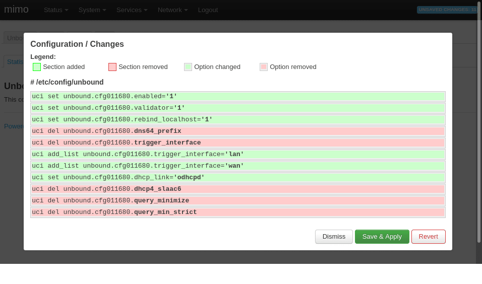

### System ⇨ System

```
uci del system.ntp.enabled
uci set system.cfg01e48a.zonename='Europe/Berlin'
uci set system.cfg01e48a.hostname='mimo'
uci set system.cfg01e48a.log_proto='udp'
uci set system.cfg01e48a.conloglevel='8'
uci set system.cfg01e48a.cronloglevel='5'
uci set system.cfg01e48a.timezone='CET-1CEST,M3.5.0,M10.5.0/3'
uci set system.ntp.enable_server='1'
uci del system.ntp.server
uci add_list system.ntp.server='0.de.pool.ntp.org'
uci add_list system.ntp.server='1.de.pool.ntp.org'
uci add_list system.ntp.server='2.de.pool.ntp.org'
uci add_list system.ntp.server='3.de.pool.ntp.org'
uci set system.ntp.use_dhcp='0'
```

### System ⇨ Administration

Set a password and enable SSH public key authentication. Beware that dropbear doesn't support ed25519 on OpenWrt 19.07.

```
uci set dropbear.cfg014dd4.Port='50022'
uci set dropbear.cfg014dd4.RootPasswordAuth='off'
uci set dropbear.cfg014dd4.PasswordAuth='off'
```

### Services ⇨ Recursive DNS

```
uci set unbound.cfg011680.enabled='1'
uci set unbound.cfg011680.validator='1'
uci set unbound.cfg011680.rebind_localhost='1'
uci del unbound.cfg011680.dns64_prefix
uci del unbound.cfg011680.trigger_interface
uci add_list unbound.cfg011680.trigger_interface='lan'
uci add_list unbound.cfg011680.trigger_interface='wan'
uci set unbound.cfg011680.dhcp_link='odhcpd'
uci del unbound.cfg011680.dhcp4_slaac6
uci del unbound.cfg011680.query_minimize
uci del unbound.cfg011680.query_min_strict
```

### Network ⇨ Interfaces ⇨ LAN

If you change the IP of the LAN interface like I do you need to change the static IP on your working machine accordingly and access the router's web interface available at the new IP within a certain time. Otherwise, the IP settings of the router are reverted.

```
uci set dhcp.lan=dhcp
uci set dhcp.lan.start='100'
uci set dhcp.lan.leasetime='12h'
uci set dhcp.lan.limit='150'
uci set dhcp.lan.interface='lan'
uci set dhcp.lan.ra='server'
uci set dhcp.lan.dhcpv6='server'
uci set dhcp.lan.ra_management='1'
uci set network.lan.ipaddr='192.168.0.1'
```

### Network ⇨ Interfaces ⇨ WAN

```
uci set network.wan.proto='pppoe'
uci set network.wan.username='XXX'
uci set network.wan.ipv6='auto'
uci add_list network.wan.dns='127.0.0.1'
uci set network.wan.peerdns='0'
uci set network.wan.keepalive='3 5'
uci set network.wan.password='XXX'
```

### Network ⇨ Interfaces ⇨ WAN6

```
uci add_list network.wan6.dns='::1'
uci set network.wan6.reqprefix='auto'
uci set network.wan6.reqaddress='try'
uci set network.wan6.peerdns='0'
```

### Network ⇨ Wireless

```
uci set wireless.radio0.channel='auto'
uci set wireless.radio0.legacy_rates='0'
uci set wireless.radio0.htmode='VHT40'
uci set wireless.radio0.country='DE'
uci set wireless.default_radio0.ssid='XXX'
uci set wireless.default_radio0.encryption='sae-mixed'
uci set wireless.default_radio0.wpa_disable_eapol_key_retries='1'
uci set wireless.default_radio0.ieee80211w='1'
uci set wireless.default_radio0.key='XXX'
uci set wireless.radio1.channel='auto'
uci set wireless.radio1.legacy_rates='0'
uci set wireless.radio1.country='DE'
uci set wireless.default_radio1.ssid='XXX'
uci set wireless.default_radio1.encryption='sae-mixed'
uci set wireless.default_radio1.wpa_disable_eapol_key_retries='1'
uci set wireless.default_radio1.ieee80211w='1'
uci set wireless.default_radio1.key='XXX'
```

... and enable Wifi.

### Configuration over SSH

In contrast to Dnsmasq, DHCPv4 configuration over `luci` is limited for odhcpd. Thus, I need to [execute the following over SSH](https://openwrt.org/docs/guide-user/base-system/dhcp_configuration#replacing_dnsmasq_with_odhcpd_and_unbound):

```bash
remote $ uci set dhcp.lan.dhcpv4="server"
remote $ uci set dhcp.odhcpd.maindhcp="1"
remote $ uci set dhcp.odhcpd.leasetrigger="/usr/lib/unbound/odhcpd.sh"
remote $ uci commit dhcp
remote $ /etc/init.d/odhcpd restart
remote $ uci set unbound.@unbound[0].unbound_control="1"
remote $ uci commit unbound
remote $ /etc/init.d/unbound restart
```

### Network ⇨ Firewall ⇨ "General Settings"

Drop invalid packets:

```bash
uci del firewall.cfg01e63d.syn_flood
uci set firewall.cfg01e63d.drop_invalid='1'
uci set firewall.cfg01e63d.synflood_protect='1'
```

## Advanced Configuration

With the help of the [Basic Configuration](#basic-configuration) I have internet up and running. Now, I am going to take care of the more advanced stuff.

### Harden http/https access

Execute this over SSH to make `luci` listen only on localhost:

```bash
uci -q delete uhttpd.main.listen_http
uci add_list uhttpd.main.listen_http="127.0.0.1:80"
uci add_list uhttpd.main.listen_http="[::1]:80"
uci -q delete uhttpd.main.listen_https
uci add_list uhttpd.main.listen_https="127.0.0.1:443"
uci add_list uhttpd.main.listen_https="[::1]:443"
uci commit uhttpd
/etc/init.d/uhttpd restart
```

To access `luci` execute `ssh -NL 8080:localhost:80 -p 50022 root@192.168.0.1` and visit http://localhost:8080

### gopass/pass

Adjust `/dev/sda1` and `/dev/sdb1` as you see fit. If the mdadm device has not been assembled, do:

```bash
remote $ lsusb -t
remote $ blkid /dev/sd[a-z]1
remote $ mdadm --assemble /dev/md0 /dev/sda1 /dev/sdb1
mdadm: /dev/md0 has been started with 2 drives.
remote $ blkid /dev/md0
/dev/md0: UUID="XXXXXXXX-XXXX-XXXX-XXXX-XXXXXXXXXXXX" TYPE="ext4"
```

We need to make the RAID1 device assemble at bootup:

```bash
remote $ uci show mdadm
mdadm.@mdadm[0]=mdadm
mdadm.@mdadm[0].email='root'
mdadm.@array[0]=array
mdadm.@array[0].uuid='52c5c44a:d2162820:f75d3464:799750f8'
mdadm.@array[0].device='/dev/md0'
```

Replace the UUID starting with `52c5c44a`, which is non-existent and unused:

```bash
remote $ uci set mdadm.@array[0].uuid="$(mdadm --detail /dev/md0 | grep UUID | awk '{print $NF}')"
remote $ uci show mdadm
mdadm.@mdadm[0]=mdadm
mdadm.@mdadm[0].email='root'
mdadm.@array[0]=array
mdadm.@array[0].device='/dev/md0'
mdadm.@array[0].uuid='XXXXXXXX:XXXXXXXX:XXXXXXXX:XXXXXXXX'
remote $ uci commit mdadm
```

List the fstab entries and delete those belonging the USB partitions e.g. `/dev/sda1` and `/dev/sdb1` ([further info](https://openwrt.org/docs/guide-user/storage/fstab)). They are not needed.

```bash
remote $ block detect | uci import fstab
remote $ uci show fstab
remote $ uci del fstab.@mount[0]
remote $ uci show fstab
remote $ uci del fstab.@mount[0]
```

Now, it should look like:

```bash
remote $ uci show fstab
fstab.@global[0]=global
fstab.@global[0].anon_swap='0'
fstab.@global[0].anon_mount='0'
fstab.@global[0].auto_swap='1'
fstab.@global[0].auto_mount='1'
fstab.@global[0].delay_root='5'
fstab.@global[0].check_fs='0'
fstab.@mount[0]=mount
fstab.@mount[0].target='/mnt/md0'
fstab.@mount[0].uuid='XXXXXXXX-XXXX-XXXX-XXXX-XXXXXXXXXXXX'
fstab.@mount[0].enabled='0'
```

Create the directory where the RAID1 device is going to be mounted to, enable the fstab entry and apply all changes:

```bash
remote $ mkdir /mnt/md0
remote $ uci set fstab.@mount[0].enabled='1'
remote $ uci commit fstab
```

Make your router reboot and check whether the RAID device has been mounted to `/mnt/md0`:

```bash
remote $ mount | grep mnt
/dev/md0 on /mnt/md0 type ext4 (rw,relatime,data=ordered)
```

I create an additional SSH RSA keypair for restricted access. Beware that dropbear doesn't support ed25519 on OpenWrt 19.07.

```bash
local $ ssh-keygen -f ~/.ssh/id_rsa_pass
```

The new keypair needs to be uploaded at `http://<ROUTER IP>/cgi-bin/luci/admin/system/admin/sshkeys` and needs to have the prefix:

```
no-agent-forwarding,no-port-forwarding,no-pty,no-X11-forwarding,command="/usr/local/bin/git-wrapper.sh" ssh-rsa ...
```

Infos on the options can be found here:
https://linux.die.net/man/8/dropbear

**The configuration expects the gopass/pass Git repo to be stored as `/mnt/md0/pass/.git`.**

On my laptop, I have the following settings:

```bash
local $ cd ~/.password-store
local $ git remote -v
origin  pass:/mnt/md0/pass/.git (fetch)
origin  pass:/mnt/md0/pass/.git (push)
local $ grep -A4 "Host pass"  ~/.ssh/config
Host pass
User root
HostName 192.168.0.1
Port 50022
IdentityFile ~/.ssh/id_rsa_pass
```

### WireGuard

For WireGuard to work we need certain firewall rules. I will go in depth in the following chapters. The result is shown in the next screenshots. **For shortness sake I am only showing the firewall rules created in the following chapters.**

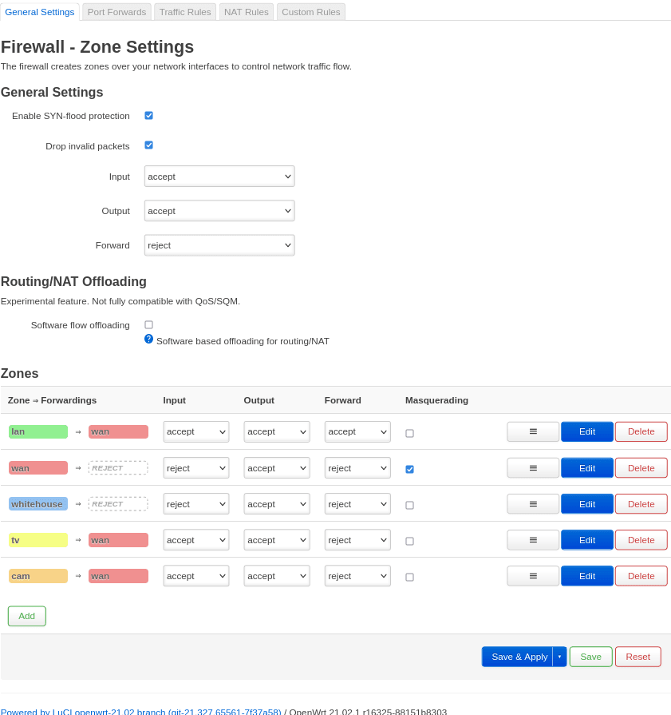

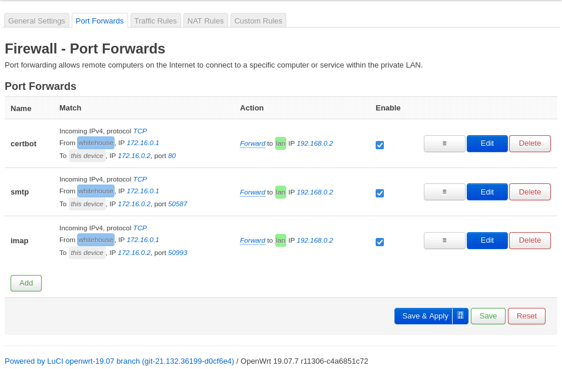

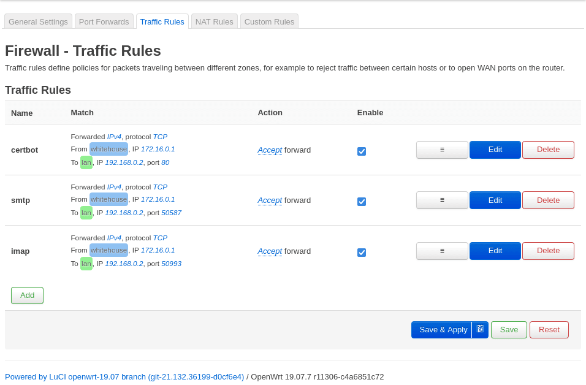


#### Create WireGuard files

Execute these commands on the router:

```bash
remote $ ( umask go= && \
wg genkey | tee /tmp/wg_router.key | wg pubkey > /tmp/wg_router.pub && \
wg genpsk > /tmp/wg_router.psk )
```

Execute these commands on the vServer:

```bash
remote $ ( umask go= && \
wg genkey | tee /tmp/wg_vserver.key | wg pubkey > /tmp/wg_vserver.pub )
```

#### Network ⇨ Firewall ⇨ "General Settings"

A firewall zone needs to be created. I **only** enable outgoing traffic.

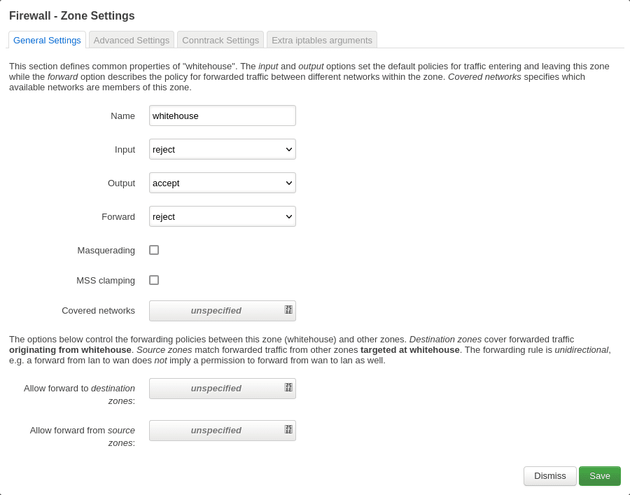

Disable IPv6:

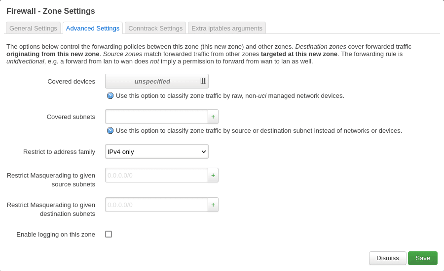

The resulting commands:

```
uci add firewall zone # =cfg0fdc81
uci set firewall.@zone[-1].name='whitehouse'
uci set firewall.@zone[-1].family='ipv4'
uci set firewall.@zone[-1].input='REJECT'
uci set firewall.@zone[-1].forward='REJECT'
uci set firewall.@zone[-1].output='ACCEPT'
```

#### Network ⇨ Interfaces

  1. Click "Add new interface..."
  2. Name your Wireguard VPN, set "Protocol" to "Wireguard VPN" and click "Create Interface"
  3. Configure as shown in these screenshots:

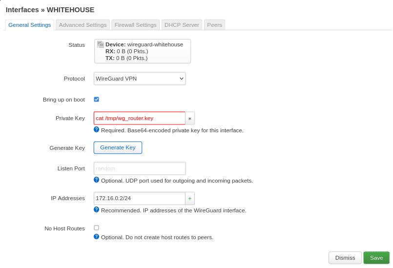


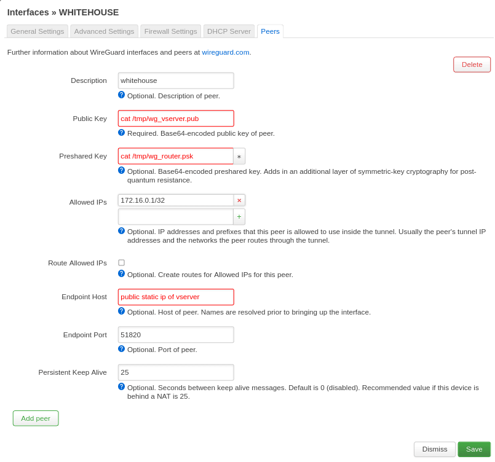

```
uci add_list firewall.cfg0fdc81.network='whitehouse'
uci set network.whitehouse=interface
uci set network.whitehouse.proto='wireguard'
uci add network wireguard_whitehouse # =cfg0a9cf3
uci set network.whitehouse.delegate='0'
uci add_list network.whitehouse.addresses='172.16.0.2/24'
uci set network.whitehouse.private_key="$(cat /tmp/wg_router.key)"
uci set network.@wireguard_whitehouse[-1].public_key="$(cat /tmp/wg_vserver.pub)"
uci set network.@wireguard_whitehouse[-1].description='whitehouse'
uci set network.@wireguard_whitehouse[-1].persistent_keepalive='25'
uci set network.@wireguard_whitehouse[-1].endpoint_port='51820'
uci add_list network.@wireguard_whitehouse[-1].allowed_ips='172.16.0.1/32'
uci set network.@wireguard_whitehouse[-1].preshared_key="$(cat /tmp/wg_router.psk)"
uci set network.@wireguard_whitehouse[-1].endpoint_host='<PUBLIC STATIC IP OF VSERVER>'
```

#### Network ⇨ Firewall ⇨ "Traffic Rules" (Filter)


```
uci add firewall rule # =cfg1092bd
uci add_list firewall.@rule[-1].proto='tcp'
uci set firewall.@rule[-1].extra='-m conntrack --ctstate NEW'
uci add_list firewall.@rule[-1].dest_ip='192.168.0.2'
uci set firewall.@rule[-1].dest_port='80'
uci set firewall.@rule[-1].src='whitehouse'
uci set firewall.@rule[-1].name='certbot'
uci add_list firewall.@rule[-1].src_ip='172.16.0.1'
uci set firewall.@rule[-1].dest='lan'
uci set firewall.@rule[-1].target='ACCEPT'
uci set firewall.@rule[-1].family='ipv4'
```


```
uci add firewall rule # =cfg1192bd
uci add_list firewall.@rule[-1].proto='tcp'
uci set firewall.@rule[-1].extra='-m conntrack --ctstate NEW'
uci add_list firewall.@rule[-1].dest_ip='192.168.0.2'
uci set firewall.@rule[-1].dest_port='50587'
uci set firewall.@rule[-1].src='whitehouse'
uci set firewall.@rule[-1].name='smtp'
uci add_list firewall.@rule[-1].src_ip='172.16.0.1'
uci set firewall.@rule[-1].dest='lan'
uci set firewall.@rule[-1].target='ACCEPT'
uci set firewall.@rule[-1].family='ipv4'
```


```
uci add firewall rule # =cfg1292bd
uci add_list firewall.@rule[-1].proto='tcp'
uci set firewall.@rule[-1].extra='-m conntrack --ctstate NEW'
uci add_list firewall.@rule[-1].dest_ip='192.168.0.2'
uci set firewall.@rule[-1].dest_port='50993'
uci set firewall.@rule[-1].src='whitehouse'
uci set firewall.@rule[-1].name='imap'
uci add_list firewall.@rule[-1].src_ip='172.16.0.1'
uci set firewall.@rule[-1].dest='lan'
uci set firewall.@rule[-1].target='ACCEPT'
uci set firewall.@rule[-1].family='ipv4'
```

#### Network ⇨ Firewall ⇨ "Port Forwards" (DNAT)


```
uci add firewall redirect # =cfg133837
uci add_list firewall.@redirect[-1].proto='tcp'
uci set firewall.@redirect[-1].src_dport='80'
uci set firewall.@redirect[-1].dest_ip='192.168.0.2'
uci set firewall.@redirect[-1].reflection='0'
uci set firewall.@redirect[-1].src='whitehouse'
uci set firewall.@redirect[-1].name='certbot'
uci set firewall.@redirect[-1].src_ip='172.16.0.1'
uci set firewall.@redirect[-1].src_dip='172.16.0.2'
uci set firewall.@redirect[-1].dest='lan'
uci set firewall.@redirect[-1].target='DNAT'
```


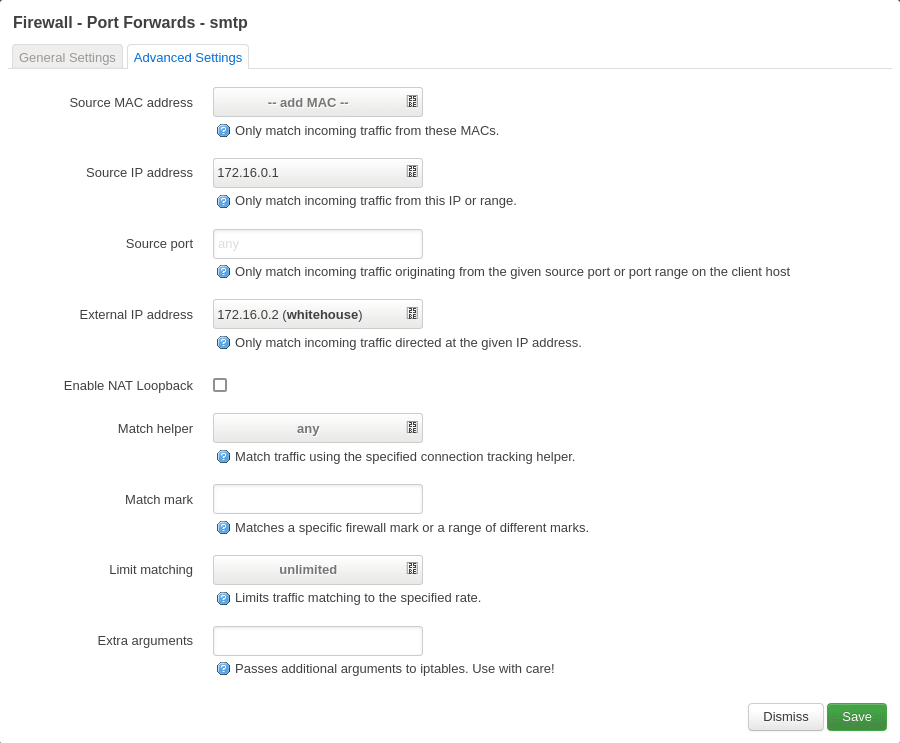

```
uci add firewall redirect # =cfg143837
uci add_list firewall.@redirect[-1].proto='tcp'
uci set firewall.@redirect[-1].src_dport='50587'
uci set firewall.@redirect[-1].dest_ip='192.168.0.2'
uci set firewall.@redirect[-1].reflection='0'
uci set firewall.@redirect[-1].src='whitehouse'
uci set firewall.@redirect[-1].name='smtp'
uci set firewall.@redirect[-1].src_ip='172.16.0.1'
uci set firewall.@redirect[-1].src_dip='172.16.0.2'
uci set firewall.@redirect[-1].dest='lan'
uci set firewall.@redirect[-1].target='DNAT'
```


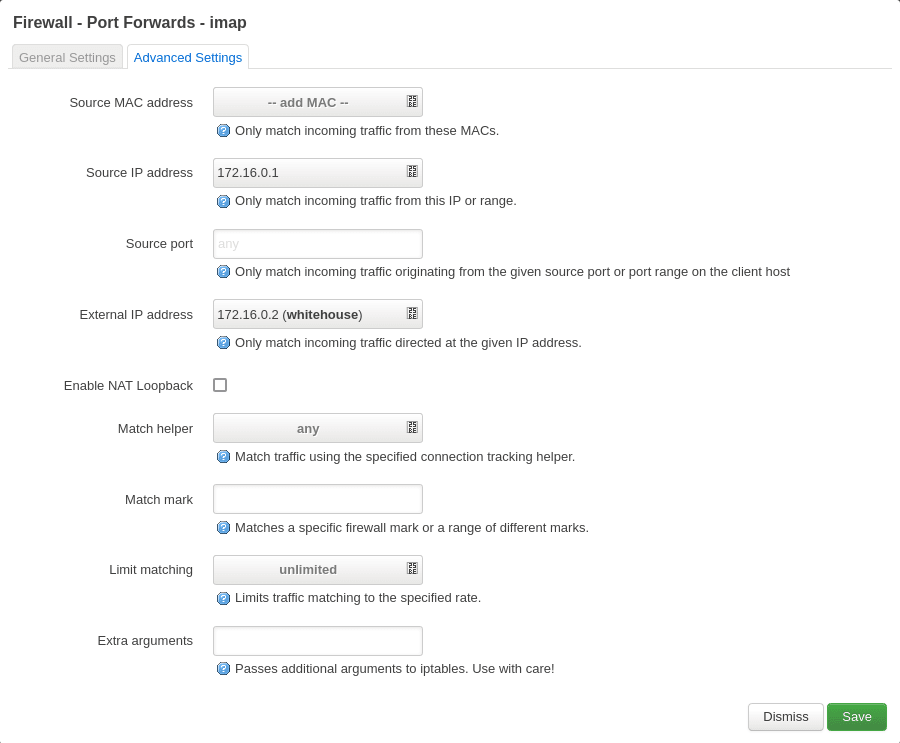

```
uci add firewall redirect # =cfg153837
uci add_list firewall.@redirect[-1].proto='tcp'
uci set firewall.@redirect[-1].src_dport='50993'
uci set firewall.@redirect[-1].dest_ip='192.168.0.2'
uci set firewall.@redirect[-1].reflection='0'
uci set firewall.@redirect[-1].src='whitehouse'
uci set firewall.@redirect[-1].name='imap'
uci set firewall.@redirect[-1].src_ip='172.16.0.1'
uci set firewall.@redirect[-1].src_dip='172.16.0.2'
uci set firewall.@redirect[-1].dest='lan'
uci set firewall.@redirect[-1].target='DNAT'
```

#### Network ⇨ Firewall ⇨ "NAT Rules" (SNAT)


```
uci add firewall nat # =cfg1693c8
uci set firewall.@nat[-1].dest_port='80'
uci add_list firewall.@nat[-1].proto='tcp'
uci set firewall.@nat[-1].name='certbot'
uci set firewall.@nat[-1].src_ip='172.16.0.1'
uci set firewall.@nat[-1].target='SNAT'
uci set firewall.@nat[-1].dest_ip='192.168.0.2'
uci set firewall.@nat[-1].snat_ip='192.168.0.1'
uci set firewall.@nat[-1].src='lan'
```


```
uci add firewall nat # =cfg1793c8
uci set firewall.@nat[-1].dest_port='50587'
uci add_list firewall.@nat[-1].proto='tcp'
uci set firewall.@nat[-1].name='smtp'
uci set firewall.@nat[-1].src_ip='172.16.0.1'
uci set firewall.@nat[-1].target='SNAT'
uci set firewall.@nat[-1].dest_ip='192.168.0.2'
uci set firewall.@nat[-1].snat_ip='192.168.0.1'
uci set firewall.@nat[-1].src='lan'
```


```
uci add firewall nat # =cfg1893c8
uci set firewall.@nat[-1].dest_port='50993'
uci add_list firewall.@nat[-1].proto='tcp'
uci set firewall.@nat[-1].name='imap'
uci set firewall.@nat[-1].src_ip='172.16.0.1'
uci set firewall.@nat[-1].target='SNAT'
uci set firewall.@nat[-1].dest_ip='192.168.0.2'
uci set firewall.@nat[-1].snat_ip='192.168.0.1'
uci set firewall.@nat[-1].src='lan'
```

#### Network ⇨ Firewall ⇨ "Custom Rules" (Reflection)

Don't forget to set the IP of the vServer:

```
# make mail server accessible to lan in case of internet downtime
iptables -t nat -A zone_lan_prerouting  -s 192.168.0.0/24 -d <PUBLIC STATIC IP OF VSERVER> -p tcp -m multiport --dports 50587,50993 -j DNAT --to-destination 192.168.0.2 -m comment --comment "mail reflection"
iptables -t nat -A zone_lan_postrouting -s 192.168.0.0/24 -d 192.168.0.2    -p tcp -m multiport --dports 50587,50993 -j SNAT --to 192.168.0.1             -m comment --comment "mail reflection"
```

### Guest Wifi for Smart-TV

I like to have my Smart-TV in a guest Wifi, separated from my LAN.

#### Network ⇨ Firewall ⇨ "General Settings"

Frist, I create a firewall zone as shown in [Network ⇨ Firewall ⇨ "General Settings"](#network--firewall--general-settings-1). Just replace "whitehouse" with "tv", don't disable IPv6 and allow ingoing traffic:

```
uci add firewall zone # =cfg19dc81
uci set firewall.@zone[-1].name='tv'
uci set firewall.@zone[-1].input='ACCEPT'
uci set firewall.@zone[-1].forward='REJECT'
uci set firewall.@zone[-1].output='ACCEPT'
```

#### Network ⇨ Interfaces

Create the `tv` interface:


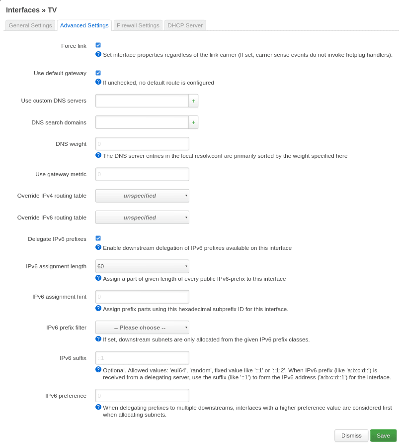


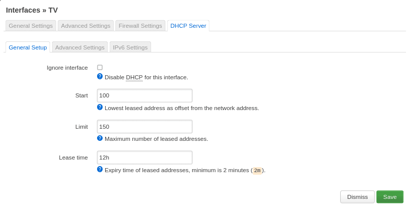


```
uci set dhcp.tv=dhcp
uci set dhcp.tv.start='100'
uci set dhcp.tv.leasetime='12h'
uci set dhcp.tv.limit='150'
uci set dhcp.tv.interface='tv'
uci set dhcp.tv.ra='server'
uci set dhcp.tv.dhcpv6='server'
uci set dhcp.tv.ra_management='1'
uci add_list firewall.cfg19dc81.network='tv'
uci set network.tv=interface
uci set network.tv.type='bridge'
uci set network.tv.proto='static'
uci set network.tv.netmask='255.255.255.0'
uci set network.tv.ipaddr='192.168.1.1'
uci set network.tv.ip6assign='60'
```

Connect to the router via SSH and enable DHCPv4:

```bash
remote $ uci set dhcp.tv.dhcpv4="server"
remote $ uci commit dhcp
remote $ /etc/init.d/odhcpd restart
```

#### Network ⇨ Wireless

The wireless network needs to be created:

```
uci set wireless.wifinet2=wifi-iface
uci set wireless.wifinet2.ssid='tv'
uci set wireless.wifinet2.encryption='sae-mixed'
uci set wireless.wifinet2.device='radio0'
uci set wireless.wifinet2.isolate='1'
uci set wireless.wifinet2.key='XXX'
uci set wireless.wifinet2.network='tv'
uci set wireless.wifinet2.mode='ap'
uci set wireless.wifinet2.wpa_disable_eapol_key_retries='1'
uci set wireless.wifinet2.ieee80211w='1'
uci set wireless.wifinet3=wifi-iface
uci set wireless.wifinet3.ssid='tv'
uci set wireless.wifinet3.encryption='sae-mixed'
uci set wireless.wifinet3.device='radio1'
uci set wireless.wifinet3.isolate='1'
uci set wireless.wifinet3.key='XXX'
uci set wireless.wifinet3.network='tv'
uci set wireless.wifinet3.mode='ap'
uci set wireless.wifinet3.wpa_disable_eapol_key_retries='1'
uci set wireless.wifinet3.ieee80211w='1'
```

#### Network ⇨ Firewall ⇨ "General Settings"

Finally, I allow traffic to be forwarded from `tv` zone to `wan` zone. For this purpose, edit `tv` zone and set `wan` at `Allow forward to destination zones:`.

```
uci add firewall forwarding # =cfg1aad58
uci set firewall.@forwarding[-1].dest='wan'
uci set firewall.@forwarding[-1].src='tv'
```

### Separate LAN for Webcam

The webcam's base station is connected to the router on port "LAN1" via ethernet. I like to separate this network from LAN via VLAN.

#### Network ⇨ Switch

We need to assign "LAN1" port to a separate VLAN which has port number 3 in below screenshot:

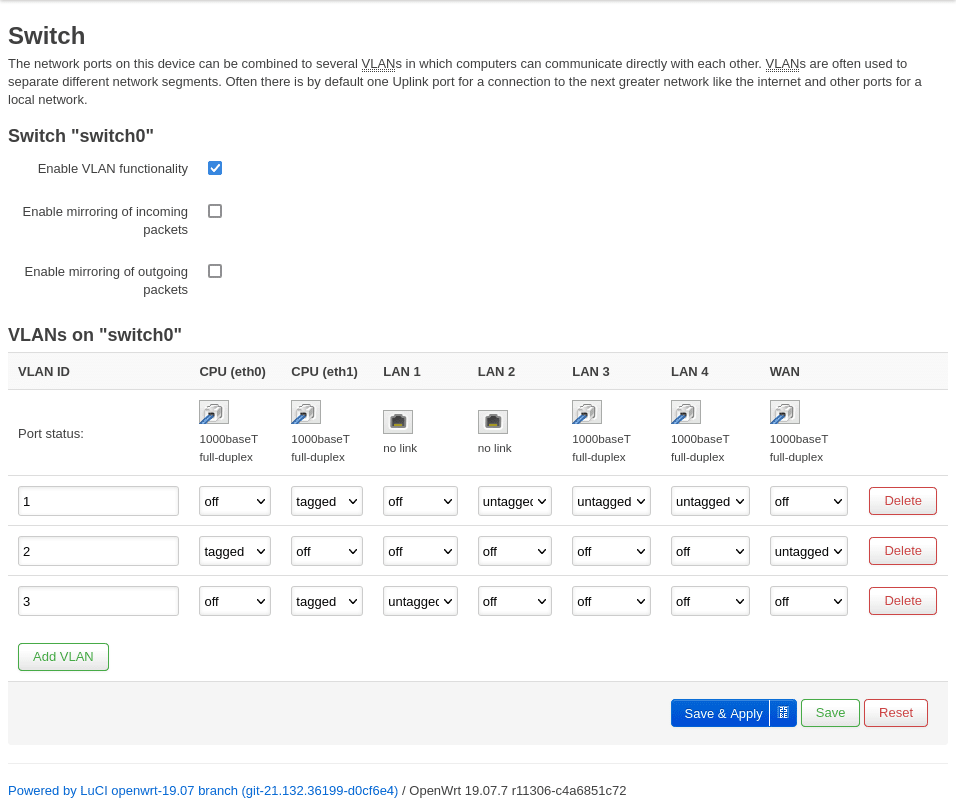

```
uci add network switch_vlan # =cfg0c1ec7
uci set network.@switch_vlan[-1].device='switch0'
uci set network.@switch_vlan[-1].vlan='3'
uci set network.cfg071ec7.vid='1'
uci set network.cfg081ec7.ports='0t 5'
uci set network.cfg081ec7.vid='2'
uci set network.cfg071ec7.ports='1 2 3 6t'
uci set network.@switch_vlan[-1].ports='4 6t'
uci set network.@switch_vlan[-1].vid='3'
```

#### Network ⇨ Firewall ⇨ "General Settings"

A firewall zone as shown in [Network ⇨ Firewall ⇨ "General Settings"](#network--firewall--general-settings-1) needs to be created. Just replace "whitehouse" with "cam", don't disable IPv6 and allow ingoing traffic:

```
uci add firewall zone # =cfg1bdc81
uci set firewall.@zone[-1].input='ACCEPT'
uci set firewall.@zone[-1].forward='REJECT'
uci set firewall.@zone[-1].name='cam'
uci set firewall.@zone[-1].output='ACCEPT'
```

#### Network ⇨ Interfaces

Create the `cam` interface as shown in [Network ⇨ Interfaces](#network--interfaces-1). But, change the IP address and assign the "LAN1" port to the bridge.

```
uci set dhcp.cam=dhcp
uci set dhcp.cam.start='100'
uci set dhcp.cam.leasetime='12h'
uci set dhcp.cam.limit='150'
uci set dhcp.cam.interface='cam'
uci set dhcp.cam.ra='server'
uci set dhcp.cam.dhcpv6='server'
uci set dhcp.cam.ra_management='1'
uci add_list firewall.cfg1bdc81.network='cam'
uci set network.cam=interface
uci set network.cam.proto='static'
uci set network.cam.ifname='eth1.3'
uci set network.cam.type='bridge'
uci set network.cam.netmask='255.255.255.0'
uci set network.cam.ipaddr='192.168.2.1'
uci set network.cam.ip6assign='60'
```

Connect to the router via SSH and enable DHCPv4:

```bash
remote $ uci set dhcp.cam.dhcpv4="server"
remote $ uci commit dhcp
remote $ /etc/init.d/odhcpd restart
```

#### Network ⇨ Firewall ⇨ "General Settings"

Finally, I allow traffic to be forwarded from `cam` zone to `wan` zone. For this purpose, edit `cam` zone and set `wan` at `Allow forward to destination zones:`.

```
uci add firewall forwarding # =cfg1cad58
uci set firewall.@forwarding[-1].dest='wan'
uci set firewall.@forwarding[-1].src='cam'
```